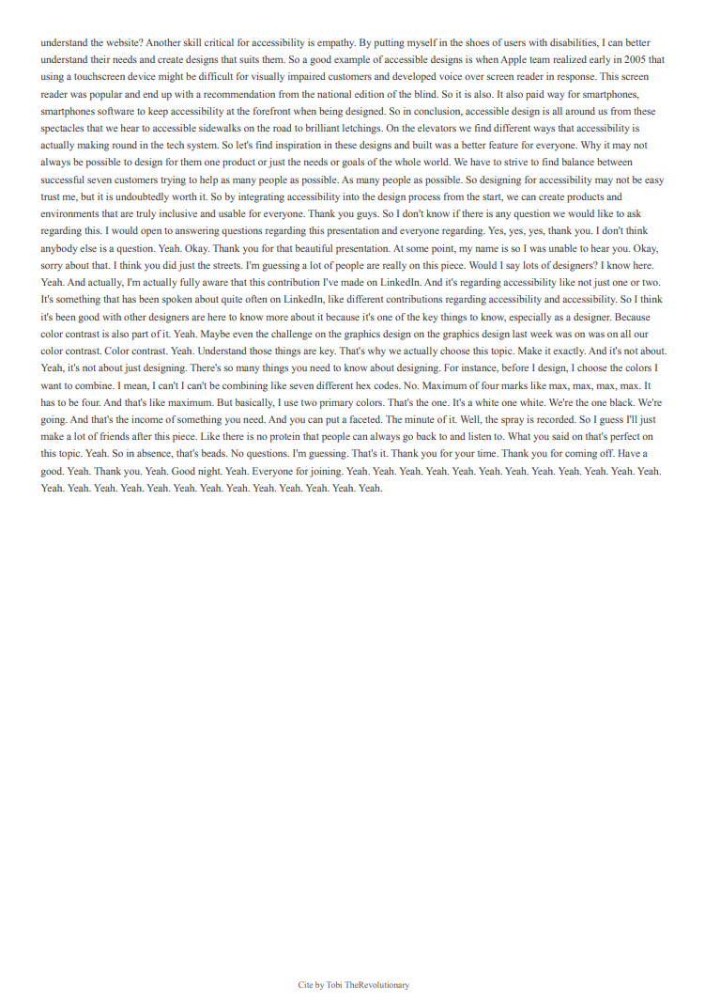

# Cite - Your X Space Transcription and Analysis Bot

Cite is a Discord bot that helps you extract insights and data from Twitter Spaces. It downloads, transcribes, and analyzes Twitter Spaces, providing summaries, highlights, and in-depth analysis.

## Features

* **Download Twitter Spaces:** Download spaces using their URL.
* **Transcribe Spaces:** Generate accurate transcriptions of the audio.
* **Summarize Conversations:** Get concise summaries of the key points discussed.
* **Generate Highlights:**  Extract important highlights from the conversation.
* **Analyze Transcriptions:** Get in-depth analysis of the conversation.
* **Generate Highlight Cards:** Create visually appealing images with key highlights.
* **PDF Generation:**  Download transcriptions, summaries, and analyses as PDFs.

## How it Works

Cite uses the following technologies:

* **`twspace_dl`:** To download Twitter Spaces.
* **Whisper:**  For audio transcription.
* **OpenAI API:**  To generate summaries, highlights, and analysis.
* **Discord API:** To interact with Discord.
* **WeasyPrint:** To generate PDF files.
* **Pillow (PIL):** To create highlight card images.

## Requirements

* Python 3.7 or higher
* Discord bot token
* OpenAI API key
* `twspace_dl`
* `whisper`
* `openai`
* `discord.py`
* `weasyprint`
* `Pillow` (PIL)
* `html2text`
* `markdown2`

## Installation

1. **Clone the repository:**
   ```bash
   git clone https://github.com/Tobitheprof/cite.git 
   ```

2. **Install Dependencies:**
    ```bash
    pip install -r requirements.txt
    ```

3. **Replace the TOKEN variable in the bot.py file with your actual discor bot token. To learn how to get this token and setup permissions to invite the bot to your server, take a look at this [article]('https://www.technobezz.com/how-to-get-a-discord-bot-token/')**

4. **Replace the OpenAI API Key with your OpenAI API Key from OpenAI**

5. **Set up your environment:**
    - Create a cookies.txt file with your Twitter cookies (see twspace_dl documentation).

    *Note: Place it in the same directory as your bot.py file.*

    To get cookies from your twitter account, download this [extension]('https://chromewebstore.google.com/detail/cclelndahbckbenkjhflpdbgdldlbecc') and export your cookies to txt.

6. **Run the bot:**
   ```python
   python bot.py
   ```

## Cite in Action

<figure>
  
  <figcaption>1. When the `/download_space url_to_space` command is called, Cite downloads the space and shares it to the server. After transcribing, it shares quick highlights.</figcaption>
</figure>

<figure>
  
  
  <figcaption>2. Transcription made by Cite using a locally run Whisper model. Results vary based on hardware and speaker accents. (Example: "Arafat" transcribed as "RFHAT")</figcaption>
</figure>

<figure>
  
  <figcaption>3. After transcription, users can choose between a complete analysis or a quick summary.</figcaption>
</figure>

<figure>
  
  
  <figcaption>4. Example of a complete analysis generated by Cite using the OpenAI API.</figcaption>
</figure>

<figure>
  
  <figcaption>5. Example of a quick summary generated by Cite using the OpenAI API.</figcaption>
</figure>

MADE WITH 💗 by Tobi TheRevolutionary.